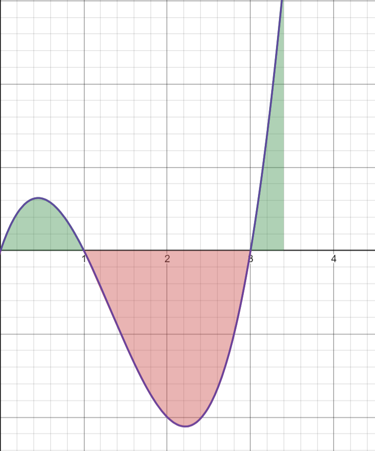
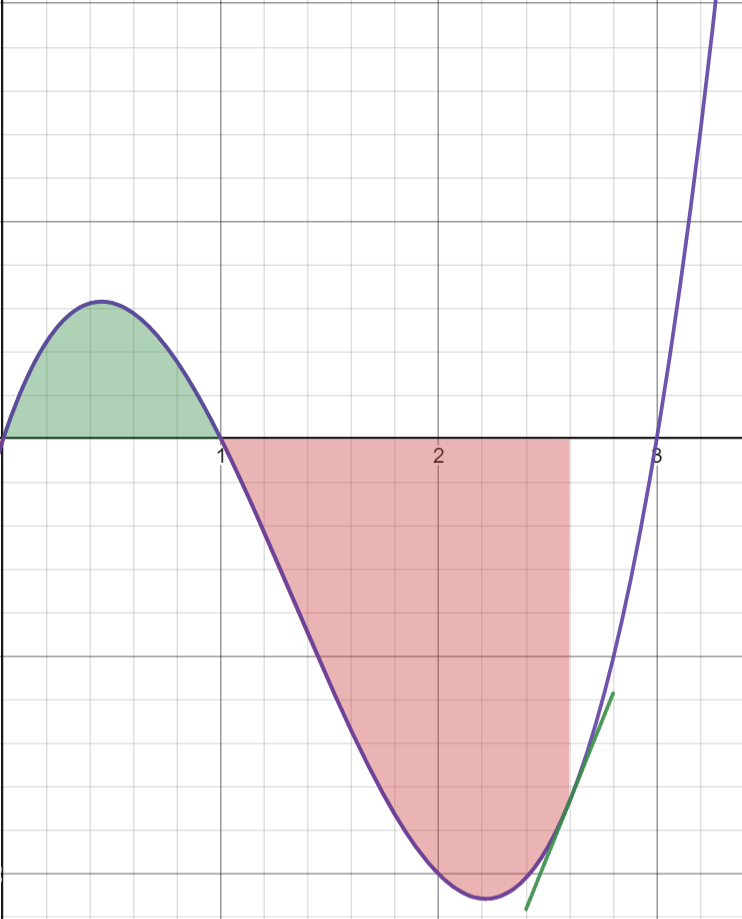

# PID

PID is the controller we use for a lot of the systems on our robot. The main concept for a PID controller is to take a desired value and an actual value, and minimize the difference between the two, which is referred to as "error". When the error is near zero then you have succesfully reached the setpoint. PID does this with three components, the Proportional component, the Integral component, and the Derivative component.

This is the underlying equation behind PID, and over the course of this week we will be teaching you what each component means

$u(t) = K_p(e(t)) + K_i\int^t_0{e(\tau)d\tau}~+ K_d(e(t)\frac{d}{dt})$

*where e(t) is the error at time t, and u(t) is the output of the PID controller*

Effectively, we have a controller for a single action, so that that aspect is tuned to use. We have individually tuned PIDs for the position and velocity of each motor, because each motor is in a unique position on the robot, with different load, friction, and other random qualities.

### Proportional

The first section of the PID Formula is proportional, P. The output here is simply directly proportional to the error.
An example scenario: We have a PID controller for a motor's position with values of {3.2,0,0}, so it only has P. We want the position to be at 40 ticks, but we are currently at 30 ticks. In this situation, our error is 10. The equation now looks as such.

$u(t) = K_p(e(t))\to u(t) = 3.2(10) = 32$

The I and D components are simply ignored, because their weight coefficients are set to 0. In a situation when we are only using P, we get an output directly proportional to the error, 32.
The P component is for quick temporary bursts, and it will often be the first thing you attempt to tune.

### Integral

The second section of the PID Formula is integral, I. The output here is the integral of the error. Lets consider an example where the PID controller has values {0,2.1,0}. Here is a potential error vs time graph

Lets imagine we are now at 3.4 seconds, and the total integral of everything prior is -1.65. Our equation now looks like this.

$u(t) = K_i\int^t_0{e(\tau)d\tau} \to u(t) = 2.1(-1.65) = -3.465$

Now, due purely to integral, our output value is -3.465.
The integral is meant to be more persistent, as if the error is zero, integral will not shift, and the output from the integral component will be relatively stable. Often, we tune integral with both its coefficient and a max value, so that we don't have an integral that compounds into infinity.

### Derivative

The final aspect of PID is derivative. The output here is based upon the derivative of error. Lets consider an example where the PID controller has values {0,0,4.2} (Terrible values in practice).

Lets look at the same error vs time graph from before, except this time we are at 2.6 seconds.

Now, we are at 2.6 seconds, observe the green line. The slope of that green line is the derivative of the error at 2.6 seconds, which is 2.48. This is what the derivative section of the equation looks like now.

$u(t) = K_d(e(t)\frac{d}{dt}) \to u(t) = 4.2(2.48) = 10.416$

The derivative has set our output to be 10.416. Derivative is meant to dampen a PID controller. If the error is moving toward zero, the derivative will add a component to make the error grow, and if the error is growing its component will make it move toward zero. It effectively dampens change.

# Exercise #1
